# 最小可执行内核

小组成员：
- 2310648 高景珩
- 2313892 章昊

---

## 实验目的

在本章中，我们将主要阐述最小可执行内核的构建方法及其详细的启动流程。本次实验的内核项目运行于Qemu模拟器之上，该模拟器为我们提供了一个64位RISC-V计算机的模拟环境。

为确保内核能与Qemu模拟器正确对接，我们首先对Qemu的启动流程、程序的内存布局以及交叉编译过程（特别是链接环节）的相关知识进行了梳理。

本章的具体内容涵盖了以下几个核心环节：
- 内存布局描述： 我们使用了链接脚本（Linker Script）来精确描述内核的内存布局。
- 编译与镜像生成： 我们通过交叉编译工具链生成了RISC-V平台的可执行文件，并在此基础上构建了最终的内核镜像。
- 引导与模拟： 我们利用OpenSBI作为引导加载程序（Bootloader），在Qemu环境中成功加载并模拟运行了内核镜像。
- 基础调试： 我们调用了OpenSBI提供的底层服务，实现了在屏幕上的格式化字符串打印，以此作为后续开发的基础调试手段。
  
---

## 实验内容

### 练习1：理解内核启动中的程序入口操作

*阅读 kern/init/entry.S内容代码，结合操作系统内核启动流程，说明指令 `la sp, bootstacktop` 完成了什么操作，目的是什么？ `tail kern_init` 完成了什么操作，目的是什么？*

根据我们查阅的资料，操作系统的启动是一个从硬件加电到内核完全接管计算机并准备好运行用户程序的精密过程。这个过程环环相扣，可以概括为以下几个核心阶段：BIOS/UEFI启动、Bootloader加载内核、内核初始化和启动、内核运行用户程序。

1. BIOS/UEFI 固件启动
   - 计算机加电后，主板上的固件（BIOS 或 UEFI）首先执行。
   - 进行开机自检 (POST)，检查 CPU、内存、硬盘等关键硬件是否正常工作。
   - 根据预设的启动顺序，查找并准备加载引导设备（如硬盘）。

2. 引导加载程序 (Bootloader)
   - BIOS/UEFI 将控制权交给存储在引导设备上的 Bootloader（例如 GRUB）。
   - Bootloader 的核心任务是将操作系统的内核映像（Kernel Image）从硬盘加载到内存中。
  
3. 内核加载与初始化前期
    - 内核映像被加载到内存后，控制权正式移交给内核。
    - 内核的执行从一个预定义的、用汇编语言编写的入口点开始，即我们代码中的 entry。
    - 在这个极早期的阶段，需要完成最基础的硬件设置，其中最关键的一步就是建立一个有效的栈空间，为即将运行的 C 语言函数做准备。

4. 内核初始化
    - 内核开始执行 C 语言代码，进行一系列的初始化操作，包括设置内核数据结构、初始化硬件设备、挂载文件系统等。
    - 最终，内核准备好运行用户程序，并开始执行用户程序的入口点。

5. 用户程序运行
    - 内核通过系统调用或进程管理机制，将用户程序加载到内存中并开始执行。
    - 用户程序可以进一步调用操作系统提供的各种服务，如文件操作、网络通信等。

在我们的学习环境中，`kern/init/entry.S` 文件扮演了上述流程中第 3 阶段的角色，是内核的“第一行代码”。它负责从硬件的原始状态过渡到 C 语言函数可以运行的环境。

对entry.S进行分析，可以得到以下结论：

```
// 包含 C 语言的头文件。汇编器在处理前，会由 C 预处理器 (cpp) 先处理这些指令。
// 引入 MMU (Memory Management Unit) 相关的宏定义，例如 PGSHIFT (页大小的对数，通常为 12)。
#include <mmu.h>

// 引入内存布局相关的宏定义，例如 KSTACKSIZE (内核栈的大小)。
#include <memlayout.h>

    // 声明一个代码段 (section)。
    // .text: 这是标准的段名，用于存放可执行指令。
    // "ax": 是段的属性标志。
    //   'a' -> allocatable (可分配)，表示加载时需要为这个段分配内存。
    //   'x' -> executable (可执行)，表示这个段中的内容是 CPU 指令。
    // %progbits: 表示这个段包含程序数据。
    .section .text,"ax",%progbits

    // .globl (同 .global) 是一个汇编指令，用于将一个符号声明为全局的。
    // 这使得链接器 (linker) 可以从其他文件中引用 kern_entry 这个符号。
    // 这里是将 kern_entry 声明为内核的全局入口点。
    .globl kern_entry

// 定义一个标签 (label) 'kern_entry'。这是引导加载程序 (Bootloader) 跳转到内核时执行的第一条指令的地址。
kern_entry:

    // 'la' 是 "Load Address" 的伪指令。
    // 'sp' 是栈指针寄存器 (Stack Pointer)。
    // 'bootstacktop' 是下面数据段中定义的一个标签，代表启动栈的最高地址。
    // 整条指令的用途：将启动栈的栈顶地址加载到 sp 寄存器中，从而初始化内核的第一个栈。
    // 这是为后续调用 C 函数 (kern_init) 做准备的关键步骤。
    la sp, bootstacktop

    // 'tail' 是一条尾调用 (Tail Call) 伪指令，它实际上是一个无条件跳转指令 (jump)。
    // 'kern_init' 是一个在其他 C 文件中定义的内核初始化函数。
    // 整条指令的用途：跳转到 kern_init 函数开始执行，并且不会保存返回地址。
    // 因为内核初始化是单向过程，永远不会返回到 kern_entry，所以使用 tail 更高效。
    tail kern_init

// 声明一个数据段 (.data)，用于存放已初始化的全局变量和静态变量。
.section .data

    // .align 是对齐指令。它确保下面的数据地址是某个值的倍数。
    // PGSHIFT 在mmu.h中设置为 12，所以 2^12 = 4KB（一个内存页）。
    // 这行代码确保 bootstack 的起始地址按页大小对齐，这对于内存管理非常重要。
    # .align 2^12
    .align PGSHIFT

    // 将 'bootstack' 符号声明为全局的，使其在链接时对其他文件可见。
    .global bootstack

// 定义一个标签 'bootstack'，它代表了内核启动栈的起始地址（最低地址）。
bootstack:

    // .space 指令用于在当前位置保留一块指定大小（字节）的连续内存空间，并用 0 填充。
    // KSTACKSIZE 是一个宏，在memlayout.h中定义了内核栈的大小（KSTACKPAGE * PGSIZE = 8KB）。
    // 这行代码为内核启动栈预留了实际的内存空间。
    .space KSTACKSIZE

    // 将 'bootstacktop' 符号声明为全局的。
    .global bootstacktop

// 定义一个标签 'bootstacktop'。
// 因为这个标签紧跟在 .space KSTACKSIZE 之后，所以它代表了 bootstack 内存区域的结束地址（最高地址）。
// 由于栈是向下生长的（从高地址向低地址使用），这个地址正是栈顶指针 sp 需要被初始化的值。
bootstacktop:
```

综上，在这段汇编代码中，`la sp, bootstacktop` 的作用是将内核启动时的栈顶地址加载到栈指针寄存器 sp 中。具体来说，bootstack 在数据段中开辟了一段空间作为内核启动栈（大小为 KSTACKSIZE），而 bootstacktop 则标记了这段栈空间的顶部地址。由于栈在 RISC-V 架构中是向下生长的，因此初始化时必须让 sp 指向栈顶位置，以便后续的函数调用和局部变量能够正确使用栈空间。这一步的目的，就是为内核初始化过程建立一个安全、独立的运行时栈环境。

接着的 `tail kern_init` 指令是一种伪指令，它的效果相当于一个“无返回”的跳转。它会直接跳转到 kern_init 函数的入口，并用新的指令地址覆盖当前调用点，而不会在栈中留下返回地址。换句话说，这是一种“尾调用优化”：执行 kern_init 时，程序不再需要返回到 kern_entry，而是将控制权完全交给 kern_init。这样做的目的，是将内核真正的初始化逻辑切换为主执行流程，避免在栈上留下无用的调用信息，同时保证内核启动流程简洁高效。

### 练习2：理解内核启动中的链接脚本

*为了熟悉使用 QEMU 和 GDB 的调试方法，请使用 GDB 跟踪 QEMU 模拟的 RISC-V 从加电开始，直到执行内核第一条指令（跳转到 `0x80200000`）的整个过程。通过调试，请思考并回答：RISC-V 硬件加电后最初执行的几条指令位于什么地址？它们主要完成了哪些功能？请在报告中简要记录你的调试过程、观察结果和问题的答案。*

#### 调试环境搭建
如果使用的是实验指导书推荐的qemu4.1.0版本，则直接使用原版的操作教程即可，但是如果qemu版本较高，就会出现`make debug`指令无法使用的情况。解决方法如下：

在执行原指导书时，我们发现了代码无法使用gdb进行调试，在查看OpenSBI的相关信息，我们发现在OpenSBI启动后，会跳转到内核的入口地址，因此我们需要在链接脚本中设置内核的入口地址。但是使用原来的`make debug`指令会找不到Domain0 Next Address的正确`0x80200000`地址，因此我们修改了Makefile，增加了相关代码如下：

```makefile
debug-sbi: $(kernel) $(SWAPIMG) $(SFSIMG)
	$(V)$(QEMU) \
		-machine virt \
		-nographic \
		-bios default \
		-kernel $(kernel) \
		-s -S
```
这样修改之后，我们就可以使用`make debug-sbi`指令进行调试了。

#### GDB基本功能测试

首先，我们测试GDB调试的基本功能：

在左控制台中输入`make debug`，右控制台输入`make gdb`。参考实验指导书，我们为`kern_entry`设置断点，然后通过`c(continue)`执行，这样就执行到了内核的入口处。

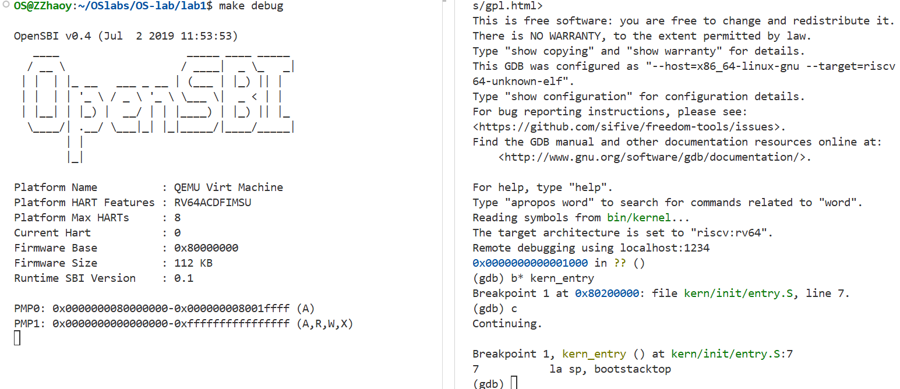

接下来，我们尝试使用`i r`命令观察寄存器当前的值。篇幅有限，这里只展示`pc sp`两个重要寄存器的值：

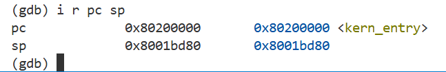

如图可见，`pc`确实为当前执行指令的地址，而`sp`栈顶指针目前还未初始化，指向一个未知的位置。

在任务1中我们已经知道，进入内核入口的第一条指令为 `la sp, bootstacktop`。使用 `si` 单步调试后再观察寄存器，可以发现此时`sp`寄存器已经被初始化为了 `0x80203000` 。

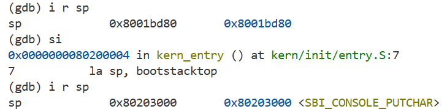

但这具体是怎么实现的？ `la sp, bootstacktop` 是一条伪指令，并不能反映准确的汇编代码。于是我们使用 `x/5i 0x80200000` 观察内核入口后五条语句的反汇编结果：

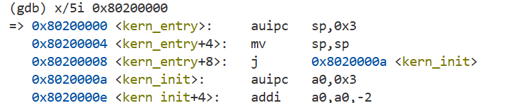

这里的 `auipc sp, 0x3`指令显然起到了初始化栈顶指针的作用。查阅资料得知，这条指令通过以下方式计算并赋值：

```text
sp = PC + (0x3 << 12)
   = 0x80200000 + 0x3000
   = 0x80203000
```

这相当于栈顶指针被设置到了距离内核起点12KB的位置，正如任务1分析的那样，这足够我们分配8KB的栈空间。

另外，原先的`tail kern_init`伪指令也转换为了两条指令。值得注意的是，其中的 `j` 指令仅长2字节，这可能是编译器优化的结果，相比于 `jal` 跳转并连接指令可以节省2字节的代码空间。

接下来可以继续运行，直到ucore打印出提示语句并进入 `while(1)` 死循环。

有了上述调试基础后，我们就可以开始观察加电初期相关指令的运行过程了。

#### 观察加电初期指令运行过程

本部分实验旨在通过GDB调试工具，深入观察和分析RISC-V平台在QEMU模拟器上从加电到加载操作系统的完整启动流程。该流程依据设计分为三个主要阶段，我们将逐一进行跟踪和验证。

##### 第一阶段：QEMU 固件引导 (Firmware Boot)

**目标： 观察QEMU如何将CPU的程序计数器（PC）初始化到0x1000，并执行固件引导代码，最终跳转到第二阶段的入口地址0x80000000。**

**过程与分析：**

在终端输入`make debug, make gdb`后，我们的RISC-V硬件就加电了，此时`pc`寄存器为`0x1000`，这是硬件刚加电时的默认地址。我们可以进行单步调试，直到发生跳转：

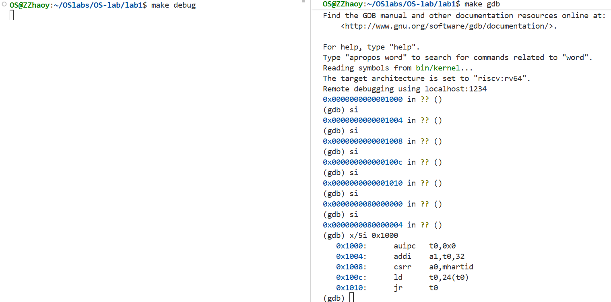

由于我们没有加载OpenSBI固件的调试符号表，GDB无法将`0x1000`等地址关联到具体的函数名或C语言源码，只能显示为`??()`。因此，我们采用反汇编命令(`x/i`)来直接查看这些地址对应的机器指令，从而分析其底层行为。

在`0x1000`地址处，我们反汇编得到如下五条指令，它们构成了OpenSBI固件的初始入口程序，其核心功能是：准备必要的初始参数，然后跳转到OpenSBI的主函数中。

```asm
0x1000: auipc t0, 0x0          # 获取pc的值
0x1004: addi  a1, t0, 32       # pc+32
0x1008: csrr  a0, mhartid      # 读取csr寄存器mhartid 的值，当前CPU核心的ID
0x100c: ld    t0, 24(t0)       # 在0x1018处读取数据覆盖t0
0x1010: jr    t0               # 跳转到t0存储的地址
```

为了探明最后的跳转目标，我们使用`x/3i 0x1018`命令查看被加载的数据内容：
```asm
(gdb) x/3i 0x1018
   0x1018:      unimp
   0x101a:      0x8000
   0x101c:      unimp
```

在RISC-V的小端序（Little-Endian）系统下，这8个字节（从0x1018到0x101f）被ld指令解释为一个64位的地址`0x80000000`。因此，jr t0指令最终将pc设置为`0x80000000`。

至此，第一阶段的引导任务完成，CPU的控制权成功从QEMU的内置引导ROM移交给了位于物理内存0x80000000的OpenSBI固件，标志着第二阶段的开始。

##### 第二阶段：OpenSBI 初始化与跳转 (OpenSBI Initialization and Jump)

**目标： 观察位于0x80000000的OpenSBI固件如何进行一系列初始化工作，并最终将控制权移交给我们的操作系统内核(os.bin)。**

**过程与分析：**

程序跳转到`0x80000000`后，我们进入了OpenSBI的执行流程。OpenSBI作为一个标准的底层执行环境，负责为上层操作系统提供统一的接口（SBI调用），并完成操作系统运行前最后的硬件初始化。继续单步调试直到再次发生跳转，我们进行分析：

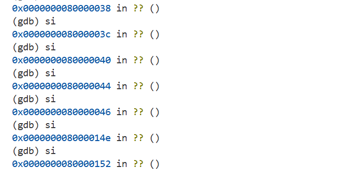

在一系列调试后，我们从`0x80000046`跳转到了`0x8000014e`。于是可以继续在`0x80000000`处反编译一些语句进行观察。

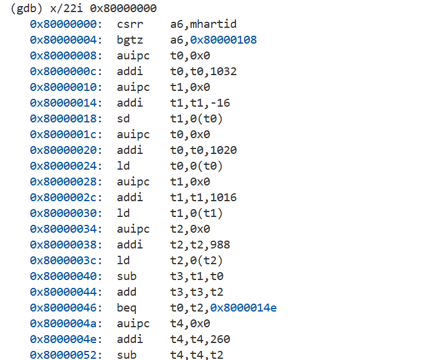

这一部分代码逻辑较为复杂，通过分析可以推断其主要功能包括：解析第一阶段传入的参数（a0, a1）、设置初始堆栈区域、初始化中断和异常代理机制、探测硬件信息，并为跳转到下一阶段（操作系统内核）做准备。

在执行过程中，我们发现程序通过`jal ra, 0x80000550`指令链接并跳转，这很可能是在调用一个重要的初始化子函数：

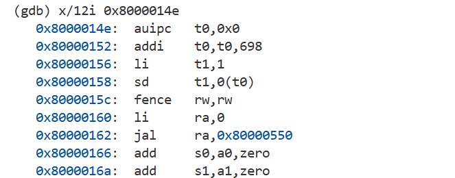

利用`x/32i 0x80000550`观察这个函数的反汇编代码，得到如下结果：

```asm
0x80000550: fence.i
0x80000554: li sp,0
0x80000556: li gp,0
0x80000558: li tp,0
0x8000055a: li t0,0
......
```

查阅资料可知，`fence.i`是一条指令缓存同步指令，用于确保之前的指令修改对后续执行可见。而后续大量的`li`指令则是将几乎所有的通用寄存器清零。显然，这个函数的功能是建立一个干净、确定的寄存器环境，清除引导固件可能留下的任何不确定状态，为操作系统内核提供一个纯净的起点。

执行完`0x8000058e`处的ret指令后，pc根据ra寄存器的值回到了`0x80000166`，这是jal指令的下一条指令，符合函数调用返回的逻辑。

我们可以在`0x80000162`处打上断点，观察前后寄存器的值（篇幅所限，只展示最后的几个寄存器）：

函数执行前，存在一些非零的寄存器：
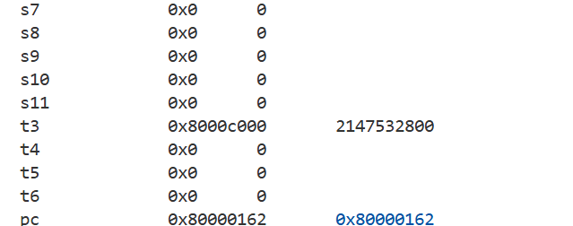

函数执行后，所有寄存器归零（ `pc, ra, a1` 除外）：
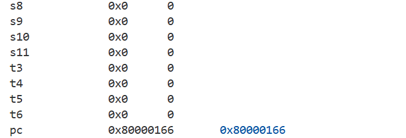

在完成所有必要的初始化后，OpenSBI的最终使命是将控制权移交给操作系统内核。根据设计，内核被加载在`0x80200000`。因此，我们可以继续执行，并最终定位到一个关键的跳转指令，它将pc设置为`0x80200000`，通常是通过`mret`指令从M-Mode（机器模式）切换到S-Mode（监督模式）并跳转。

为了精确定位从第二阶段（OpenSBI）跳转到第三阶段（内核）的关键指令，我们直接在内核入口 `kern_entry (0x80200000)` 处设置断点。程序成功在该断点处暂停，证明了控制权已成功移交。

此时，我们使用 `backtrace (bt)` 命令试图回溯调用栈，但发现调用栈为空 (`#0 kern_entry ...`)。

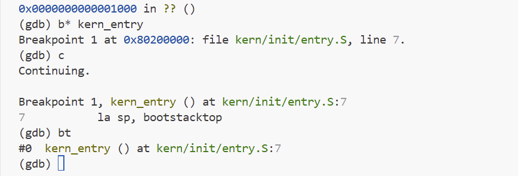

这个现象恰恰说明了跳转并非通过常规的 `jal` 函数调用指令，而是通过 `mret` 这样的特权级切换指令完成的，该指令会重置调用栈。

为了精确定位从 OpenSBI 跳转到内核的关键指令，我们利用 GDB 的硬件观察点功能，对 mepc 寄存器设置了写监视 (`watch $mepc`)。运行程序后，GDB 成功地在 mepc 被写入时暂停。

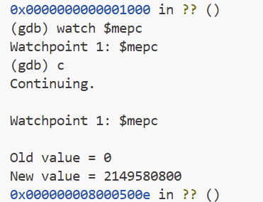

暂停的地址 `0x8000500e` 即为修改 mepc 的指令所在位置，且`$mepc`寄存器的新值`2149580800=0x20010000000`，正是内核入口的地址。通过反汇编该地址附近的指令 `(x/10i 0x8000500e - 12)`，我们发现了完整的特权级切换与跳转序列：

```asm
   0x80005002:  andi    a5,a5,-129
   0x80005006:  csrw    mstatus,a5  ; 配置mstatus，准备切换到S-Mode
   0x8000500a:  csrw    mepc,a2     ; 将内核入口地址0x80200000写入mepc
=> 0x8000500e:  li      a5,1
   0x80005010:  beq     a3,a5,0x80005026
   0x80005014:  bnez    a3,0x80005022
   0x80005016:  csrw    0x5,a2
   0x8000501a:  csrwi   0x40,0
   0x8000501e:  csrwi   0x4,0
   0x80005022:  mret                ; 执行跳转与特权级切换
```

这一发现清晰地揭示了 RISC-V 架构下，底层固件（OpenSBI）通过配置 `mstatus` 和 `mepc` 寄存器，并最终执行 `mret` 指令，从而将计算机控制权安全、规范地移交给操作系统内核的底层机制。

##### 第三阶段：内核加载与执行 (Kernel Loading and Execution)

**目标： 验证CPU控制权是否成功移交至内核入口`0x80200000`，并初步分析内核的早期初始化行为。**

**过程与分析:**
这一部分的主要分析过程我们已经在上一部分**GDB基本功能测试**进行过了，不再赘述。

整体而言，通过对`0x80200000`开始的汇编代码进行分析，我们可以逐步识别出上述行为，从而理解操作系统是如何从零开始，一步步建立起管理整个计算机硬件的运行环境的。至此，整个加电启动流程的核心部分就观察完毕了。

---

### 知识点总结与反思

本次“最小可执行内核”实验虽然只涉及操作系统最基础的启动部分，但它为我们理解OS原理中的诸多抽象概念提供了坚实的实践基础。正如实验指导书中所说，本次实验我们构建的是**比麻雀更小的麻雀**，这个过程本身就对应了操作系统最底层的基石，让我们得以较为轻松地利用理论知识观察实际工程。

#### 实验知识点与OS原理的关联分析

**1. 内核启动流程与入口点 (`entry.S`)**

*   **实验中的知识点**: 内核被加载后执行的第一段汇编代码，其核心任务是为C语言环境设置一个有效的栈空间 (`la sp, bootstacktop`)，然后将控制权移交给内核的C函数入口 (`tail kern_init`)。
*   **对应的OS原理**: **所有OS高级功能的前置条件**。
*   **理解与分析**:
    *   **关系**: OS原理课程中讨论的进程调度、内存管理等，都预设了一个前提：内核已经成功运行并接管了硬件。而本次实验的这个知识点，恰恰是在回答一个更根本的问题：“内核自身是如何先运行起来的？”。这个启动过程是所有高级OS功能得以实现的根本，没有这个过程，就没有内核的运行，也就无法执行任何管理操作。
    *   **差异**: OS原理课程通常会跳过这个“引导”阶段，直接从一个已运行的内核开始讲解。而本实验则让我们亲手实现了这个“从0到1”的过渡，深刻理解了软件是如何在“裸机”之上建立起第一个立足点开始工作的。

**2. 链接脚本与内核内存布局**

*   **实验中的知识点**: 使用链接脚本在编译链接阶段，就静态地、精确地规划了内核代码段、数据段、栈等部分在物理内存中的确切地址。例如，内核的入口被固定在`0x80200000`。
*   **对应的OS原理**:
    *   内存管理：单道程序模型。
    *   程序在运行前已预知其所需内存的上限，并在启动时一次性分配。
*   **理解与分析**:
    *   **含义**: 这些原理描述了最早期、最简单的内存管理模型。在这种模型下，整个内存只为一个程序（在这里是内核自身）服务，其内存需求和布局在运行前就已完全确定，运行时不会改变。
    *   **关系**: 实验中的链接脚本正是实现这一经典内存管理模型的**具体工具**。OS原理告诉我们“是什么”（What）——需要一个固定的内存布局；而链接脚本则让我们实践了“怎么做”（How）——通过它来定义这个布局。我们为最小内核所做的内存规划，本质上就是将内核自身视作一个“单道程序”来管理其内存。
    *   **差异**: 原理层面讨论的是一种抽象的内存管理**策略**，而实验中的链接脚本是一种具体的工程**机制**。目前我们的内核还没有为其他程序服务的概念，它只是在管理自己。

**3. GDB调试：从固件到内核的启动链与特权级切换**

*   **实验中的知识点**: 通过GDB调试，我们观察到计算机启动并非一步到位，而是经历了一个从硬件固件（`0x1000`）到引导加载程序OpenSBI（`0x80000000`），最终才到我们的内核（`0x80200000`）的控制权移交链。特别是，从OpenSBI到内核的跳转伴随着CPU特权级的切换（通过`mret`指令从M-Mode切换到S-Mode）。
*   **对应的OS原理**: **CPU特权级**。
*   **理解与分析**:
    *   **关系**: 虽然实验中尚未使用虚拟内存和MMU，但CPU的**特权级**是实现这一切的硬件基础。为什么OS有权力处理异常并管理所有内存，而应用程序没有？根本原因就在于OS运行在比应用程序更高的特权级（如内核态/Supervisor Mode），这使得它能够执行特殊指令、访问受保护的硬件。
    *   **差异**: 实验向我们展示了OS**获得这种特权**的过程——由更底层的固件在交接控制权时设定。而OS原理课程则侧重于讨论OS特权级的作用和意义，例如“进入特权态才能执行特权指令、访问特权数据、以及执行存储在特权区域的代码”等知识点。

---

#### OS原理中重要但实验未涉及的知识点

本次实验作为OS课程的第一次实验，让我们实操体验了操作系统最小可执行内核的启动流程和简单的内存布局。课程中重点学习的进程调度、内存管理等重点内容在本次实验中没有涉及，这些内容是后续实验的重点，本次报告中便不再赘述。

### 实验总结

通过本次实验，我们深入了解了RISC-V架构下计算机从加电到操作系统启动的完整过程，并掌握了GDB调试工具的基本使用方法。实验中，我们不仅观察了QEMU固件引导、OpenSBI初始化与跳转以及内核加载与执行等关键步骤，还通过GDB调试工具深入分析了底层指令的执行过程，从而对计算机启动过程有了更加深刻的理解。

