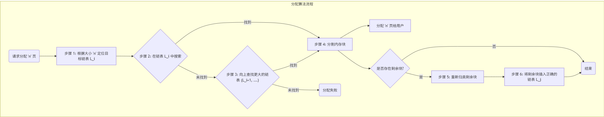
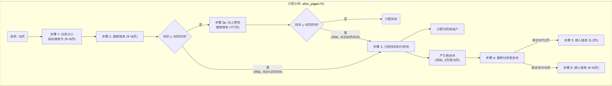
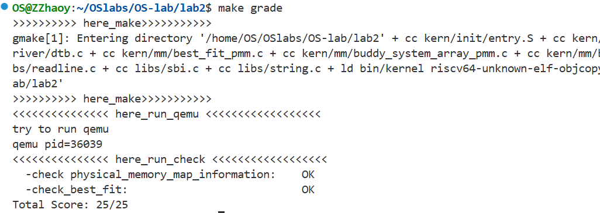

# 物理内存和页表

小组成员：
- 2310648 高景珩
- 2313892 章昊

---

## 实验目的

本实验的目的是深入理解操作系统中物理内存管理的核心概念与机制。通过分析和实现经典的连续物理内存分配算法，包括First-Fit和Best-Fit，来掌握对物理内存进行有效管理的基本方法。同时，通过可选的挑战性练习，如实现伙伴系统（Buddy System）和Slub分配算法，这将进一步探索更高级、更高效的内存管理策略，从而将操作系统原理的理论知识与ucore操作系统内核的具体实践相结合，深化对内存管理重要性和复杂性的认识。

---

## 实验内容

### 练习一：理解first-fit 连续物理内存分配算法（思考题）

*first-fit 连续物理内存分配算法作为物理内存分配一个很基础的方法，需要同学们理解它的实现过程。请大家仔细阅读实验手册的教程并结合kern/mm/default_pmm.c中的相关代码，认真分析default_init，default_init_memmap，default_alloc_pages， default_free_pages等相关函数，并描述程序在进行物理内存分配的过程以及各个函数的作用。 请在实验报告中简要说明你的设计实现过程。并分析你的first fit算法是否有进一步的改进空间？*

#### 已有实现的分析

在已有的设计与实现中，核心是围绕一个按物理地址升序排列的双向链表 `free_list` 来管理所有空闲内存。而整个实现最巧妙的地方，在于对 `struct Page` 结构体内 `flags` 和 `property` 这两个成员的协同使用。根据 `kern/mm/memlayout.h` 中的定义，`property` 字段用于记录一个连续内存块的总页数，但这个数值是否有效，则完全取决于 `flags` 字段中的 `PG_property` 标志位。

具体来说，一个 `Page` 结构体 `p` 被认为是**一个可供分配的空闲块的起始页**，当且仅当 `PageProperty(p)` 宏返回真（即 `p->flags` 中的 `PG_property` 位为1）。只有在这种情况下，`p->property` 中存储的块大小才是有意义的。如果 `PG_property` 位为0，那么这个页要么是已经被分配出去的块的首页，要么它根本就不是任何块的首页。这种“标志位 + 数据”的设计，清晰地区分了空闲块和非空闲块。

整个物理内存的生命周期管理正是在这个设计之上展开的。系统启动时，`default_init` 函数首先初始化一个空的 `free_list`。随后，内核调用 `default_init_memmap` 将可用的物理内存区域逐一加入管理。在这个函数中，一段连续内存的起始页会被设置正确的 `property` 值（即这块内存的总页数），并通过 `SetPageProperty()` 宏将其 `PG_property` 标志位置1，最后按地址顺序插入到 `free_list` 中，成为一个可用的空闲块。

当内核通过 `default_alloc_pages` 申请内存时，函数会从 `free_list` 头部开始遍历。它只关心那些 `PG_property` 标志位为1的页，并读取其 `property` 值来判断大小是否满足需求。这正是“首次适应”的体现——找到第一个满足条件的块。一旦找到，如果块过大，就会被分割成两部分：一部分用于分配，其起始页的 `PG_property` 标志位会被 `ClearPageProperty()` 清零，从而在 `free_list` 中“消失”；另一部分剩余的内存则会形成一个新的、较小的空闲块留在链表中。

内存的回收由 `default_free_pages` 函数负责。当一块内存被释放时，函数会重新计算其大小并存入起始页的 `property` 字段，然后调用 `SetPageProperty()` 将其“激活”为一个有效的空闲块，并插回 `free_list`。最关键的一步是紧随其后的合并操作：通过检查新块在链表中前后紧邻的邻居是否也是物理地址连续的空闲块，来实现自动合并，从而有效地对抗内存碎片化。

当然，目前实现的 First-Fit 算法也有其局限性。最主要的问题是，由于每次查找都从头开始，很容易导致在内存地址的低位部分遗留下许多难以再利用的微小碎片。长此以往，即使总的空闲内存还很多，也可能因为找不到足够大的连续空间而导致分配失败。

要改进这一点，可以考虑实现 **Next-Fit** 算法，让下一次分配的查找从上一次分配结束的位置开始，这样可以把内存的消耗更均匀地散布到整个地址空间。更进一步，可以实现 **Best-Fit** 算法，它会遍历整个链表，找出大小最接近申请需求的空闲块，这样做的好处是能最大限度地保留大块内存，但代价是每次分配都必须完整扫描一遍链表，效率会低一些。

一个更彻底的优化方案是实现**分离空闲链表 (Segregated Free Lists)**，即用多个链表来分别管理不同大小范围的内存块。当需要分配内存时，只需在对应大小范围的链表中查找即可，这可以极大地提升查找效率，也是现代操作系统中许多高级内存分配器的基本思想。

#### first-fit算法的改进————*分离空闲链表*

当前 First-Fit 算法的主要瓶颈在于其使用单一链表管理所有空闲块，导致分配时可能需要进行漫长的线性扫描，尤其是在内存碎片化之后。一个更彻底、更高效的优化方案是实现**分离空闲链表（Segregated Free Lists）**。该方案放弃单一链表的结构，转而采用多个链表，每个链表专门负责管理特定大小范围的内存块。这种按大小“分类”的策略，能够将内存分配的搜索时间从 O(N) 级别（N为总空闲块数）显著降低，接近 O(1)。

该设计的核心是建立一个**空闲链表数组**，数组中的每个元素都是一个独立的空闲链表头。我们称这些范围为“尺寸类”（Size Classes）。

1.  **数据结构**：
    我们将不再使用单个的 `free_area_t` 结构体，而是定义一个该结构体的数组，例如 `free_area_t free_areas[MAX_SIZE_CLASSES]`。数组的索引直接对应一个尺寸类。尺寸类的划分可以基于2的幂次，也可以是其他合理的数值范围。一个可行的划分方案如下：
    *   `free_areas[0]`: 管理大小为 1($[2^0-2^1)$) 页的块。
    *   `free_areas[1]`: 管理大小为 2-3($[2^1-2^2)$) 页的块。
    *   `free_areas[2]`: 管理大小为 4-7($[2^2-2^3)$) 页的块。
    *   `free_areas[3]`: 管理大小为 8-15($[2^3-2^4)$) 页的块。
    *   ...
    *   `free_areas[N]`: 管理所有大于某个阈值的超大块。

2.  **分配流程 (`alloc_pages`)**：
    *   **定位链表**：当收到一个分配 `n` 页的请求时，首先根据 `n` 的大小，通过一个简单的计算或查找，立即确定应该在哪一个尺寸类的链表（例如 `free_areas[i]`）中进行搜索。这个定位过程是 O(1) 的。
    *   **链表内搜索**：在确定的链表 `free_areas[i]` 内部，执行 First-Fit（或 Best-Fit）算法进行查找。因为这个链表中的块都是大小相近的，所以搜索范围被极大地缩小了，速度非常快。
    *   **向上查找（Fallback）**：如果在最匹配的链表 `free_areas[i]` 中没有找到合适的块（即链表为空），分配器不会立即失败，而是会自动地到**下一个更大尺寸类的链表**（`free_areas[i+1]`, `free_areas[i+2]`, ...）中去查找。
    *   **分割与归位**：当在一个更大的尺寸类中找到一个足够大的块时（例如，需要10页，但在16-31页的链表中找到了一个20页的块），分配器会将其分割。分配出10页后，剩余的10页会形成一个新的空闲块。最关键的是，这个新的10页空闲块需要被**重新定位**并插入到它自己所属的正确链表（8-15页的链表）中，而不是放回原来的大块链表。

3.  **释放流程 (`free_pages`)**：
    *   **合并（Coalescing）是关键**：在释放一个大小为 `n` 的内存块时，不能简单地将其直接插入对应尺寸的链表。必须先检查其物理地址前后的邻居是否也是空闲的，以进行合并。因为现在空闲块散布在不同的链表中，我们**不能再依赖链表的前后指针来寻找物理邻居**。取而代之的是，通过要释放块的基地址 `base`，直接计算出其前后物理页的地址 (`base-1` 和 `base+n`)，并检查这些 `Page` 结构体的 `PG_property` 标志位来判断它们是否是空闲块的头部。
    *   **跨链表合并**：如果邻居是空闲的，那么需要先将这个邻居从它**自己所在的链表**中移除，然后与当前释放的块合并成一个更大的新块。
    *   **重新归位**：合并完成后（可能与前后两个邻居都发生了合并），根据最终形成的新空闲块的总大小，计算出它所属的尺寸类，并将其插入到正确的空闲链表中。如果未发生合并，则直接将原始释放块插入其对应的链表。

#### 设计示意图

下面这张图直观地展示了分离空闲链表的工作模式：



下面是一个示例，展示了如何实现一个简单的分离空闲链表：



---

### 练习2：实现 Best-Fit 连续物理内存分配算法（需要编程）
*在完成练习一后，参考kern/mm/default_pmm.c对First Fit算法的实现，编程实现Best Fit页面分配算法，算法的时空复杂度不做要求，能通过测试即可。 请在实验报告中简要说明你的设计实现过程，阐述代码是如何对物理内存进行分配和释放，并回答：你的 Best-Fit 算法是否有进一步的改进空间？*

#### 设计实现过程

基于上面对First Fit连续物理内存分配算法的分析，实现Best-Fit 连续物理内存分配算法实际上只需要修改分配函数`struct Page * best_fit_alloc_pages(size_t n)`，将遍历空闲链表`free_list`的规则改为：
```c
    struct Page *page = NULL;
    list_entry_t *le = &free_list;
    size_t min_size = nr_free + 1;
    while ((le = list_next(le)) != &free_list) {
        struct Page *p = le2page(le, page_link);
        // 顺序遍历，若满足要求则记录
        if (p->property >= n && p->property < min_size) {
            page = p;
            min_size = p->property;
        }
    }
```

相较于First Fit找到第一个合适的块后就`break`，新的Best Fit算法则需要遍历整个空闲链表，记录其中`property`属性满足`p->property >= n && p->property < min_size`，即空间达到了分配的要求，且为目前记录最小的块。这样，在遍历完成后，我们就记录了Best Fit算法中所谓“最合适”的一块内存空间。

本实现的Best Fit算法初始化、释放内存方式和First Fit完全一致，这里不再赘述。原代码框架中已经为我们做好了封装，因此实现Best Fit后，通过修改`/kern/mm/pmm.c`的`init_pmm_manager`初始化函数中变量`pmm_manager`，赋值为Best Fit结构体实例的地址即可：
```c
// init_pmm_manager - initialize a pmm_manager instance
static void init_pmm_manager(void) {
    pmm_manager = &best_fit_pmm_manager;
    cprintf("memory management: %s\n", pmm_manager->name);
    pmm_manager->init();
}
```

最后，在终端执行`make qemu`，输出了如下结果：
```
Kernel executable memory footprint: 20KB
memory management: best_fit_pmm_manager
physcial memory map:
  memory: 0x0000000008000000, [0x0000000080000000, 0x0000000087ffffff].
check_alloc_page() succeeded!
satp virtual address: 0xffffffffc0204000
satp physical address: 0x0000000080204000
```

也可以使用`make grade`更清晰地展示分配器效果：


可以看到Total Score为25/25，说明我们的Best Fit通过了检验。

#### Best Fit算法的改进

在理论课课件中，Best Fit算法的描述为：

> 最佳匹配法(best-fit)：将分区按**小大顺序**组织,找到的第一个适应分区是大小与要求相差最小的空闲分区。

这显然和我们的实现不同，因为我们实现的Best Fit算法是按照地址顺序排列的，而理论上的Best Fit算法是根据分区大小顺序组织的。

两种实现方式，区别在哪呢？假设按照分区大小排序的Best Fit算法使用链表结构管理，那么分配空间是同样需要遍历`free_list`，但只要当找到的块空间大于等于所需空间，即可`break`跳出循环完成分配，性能会略好于地址排序的Best Fit算法，但时间复杂度仍然为$O(n)$。并且，这种方式产生的内存碎块，如果需要插入空闲链表，还需要继续遍历，直到找到合适的位置插入，这一部分的时间复杂度也为$O(n)$，而在地址排序方式中仅需插入到原项的同一位置，复杂度仅为$O(1)$。另一方面，在释放内存合并相邻的块时，由于空闲链表没有按照地址排序，寻找释放块的相邻块需要遍历整个空闲链表，这样合并复杂度就由$O(1)$提升到了$O(n)$，增大了时间开销，且实现更加复杂。

因此，这样的实现并不理想，性能甚至不如普通的First Fit。但查阅资料后发现，可以使用**平衡树（如AVL树）** 结构管理空闲块，并以空闲块的大小作为树的键值。我们可以再次对分配、插入、合并的时间复杂度作分析：

- 分配：要分配大小为 $N$ 的内存，只需在树中执行一次查找操作，即可高效地找到块大小大于或等于 $N$ 的节点中，最小的那个节点。这个查找过程的时间复杂度为 $O(logN)$。
- 插入：新释放的块或分割后剩余的碎片，直接按照其大小作为键值插入平衡树中。插入操作的时间复杂度也为 $O(logN)$。
- 合并：单纯的平衡树无法解决按地址合并的问题。因此，实际工程中的 Best-Fit 实现通常额外维护一个按地址排序的辅助链表或哈希表，用于快速查找物理地址相邻的块。

综上，通过结合平衡树的搜索特性和辅助结构，Best-Fit 算法能够将分配和释放等操作的时间复杂度都降至平衡且高效的 $O(logN)$，从而真正达到高内存利用率和高运行效率的兼顾。当然，这带来的代价是实现复杂度的显著提高，不利于人工维护。

---

### 练习3：扩展练习Challenge：buddy system（伙伴系统）分配算法（需要编程）
*Buddy System算法把系统中的可用存储空间划分为存储块(Block)来进行管理, 每个存储块的大小必须是2的n次幂(Pow(2, n)), 即1, 2, 4, 8, 16, 32, 64, 128...， 在ucore中实现buddy system分配算法，要求有比较充分的测试用例说明实现的正确性，需要有设计文档。*

伙伴系统（Buddy System）是一种经典的中速内存分配算法，它试图在快速分配和有效对抗外部碎片化之间取得平衡。其核心思想是将所有物理内存按 2 的幂次方大小进行划分和管理。在本课程项目中，我们探索并实现了两种不同数据结构的伙伴系统算法，以对比其设计思想和性能权衡。

两种实现均与 ucore 的 `Page` 结构体和物理内存管理器（PMM）框架深度整合，但采用了截然不同的方式来追踪和管理空闲内存块：

*   **实现一：基于分离空闲链表 (`buddy_system_list_pmm.c`)**：为每种大小的块维护一个独立的双向链表，是伙伴系统较为传统和广泛采用的方式。
*   **实现二：基于完全二叉树数组 (`buddy_system_array_pmm.c`)**：利用数组来模拟一棵管理内存的完全二叉树，将复杂的链表操作转化为高效的数组索引计算。

#### 实现一：基于分离空闲链表的伙伴系统

##### 1. 核心数据结构

为了高效管理不同大小的内存块，我们采用分离空闲链表（Segregated Free Lists）的设计。

*   **`free_area_t free_area[MAX_ORDER + 1]`**: 这是整个系统的核心。它是一个数组，每个元素代表一个“阶（order）”的内存块。数组索引 `i` 对应着大小为 `2^i` 页的内存块。`free_area[i]` 内部包含一个双向链表 `free_list`，用于链接所有当前空闲的、大小为 `2^i` 页的块，以及一个计数器 `nr_free` 来记录该阶的空闲块总数。我们设定 `MAX_ORDER` 为 16，意味着系统可管理的最大内存块为 2^16 = 65536 页。

*   **`struct Page` 的复用**: 我们巧妙地利用了 `Page` 结构中的 `property` 和 `flags` 字段来存储伙伴系统的元数据，避免了额外的内存开销。
    *   **`page->property`**: 对于一个空闲块，其首页的 `property` 字段被用来存储该块的阶（order）。块内其他页的 `property` 均为 0。
    *   **`page->flags`**: `PG_property` 标志位被用作一个信号。当一个页的 `PG_property` 位为 1 时，表示它是一个空闲块的首页，此时它的 `property` 字段才有效。对于已分配的块或非首页的页，此标志位为 0。
    *   **`page->page_link`**: 用于将空闲块的首页链接到 `free_area` 数组中对应阶的 `free_list` 上。

##### 2. 算法流程详解

###### a. 初始化 (`buddy_system_list_init` & `init_memmap`)

*   **`buddy_system_list_init`**: 此函数负责最基础的初始化。它遍历 `free_area` 数组，将 0 到 `MAX_ORDER` 阶的每一个空闲链表都初始化为空链表，并将空闲块计数器 `nr_free` 清零。
*   **`buddy_system_list_init_memmap`**: 这是伙伴系统的“创世纪”过程，它接收一段大的连续物理内存，并将其“消化”吸收进管理体系。该过程是一个自顶向下、对齐优先的分解过程：
    1.  它从当前剩余内存的起始地址 `addr` 开始，尝试匹配一个尽可能大的、且地址合规的块。
    2.  首先，它会选择一个不大于剩余内存 `remaining` 的最大阶 `order`。
    3.  然后，它会检查当前地址 `addr` 是否满足 `order` 阶块的对齐要求（即 `addr` 必须是 `2^order` 的倍数）。如果不满足，它会不断降低 `order`，直到找到一个既能放下又对齐的阶。
    4.  一旦找到合适的 `order`，就从 `addr` 处“切”下一个大小为 `2^order` 的块，设置其首页的 `property` 和 `PG_property` 标志，并将其加入 `free_list[order]`。
    5.  这个过程循环进行，直到所有初始内存都被划分为大小不一、但均符合伙伴系统规则的空闲块。

###### b. 内存分配 (`buddy_system_list_alloc_pages`)

分配过程是一个按需查找，按需分裂的策略：

1.  **计算阶数**: 根据请求的页数 `n`，计算出能满足该需求的最小阶 `order`，即 `2^order >= n`。
2.  **查找空闲块**: 从 `order` 阶开始，向上（向更大阶）遍历 `free_area` 数组，直到在 `current_order` 阶找到第一个非空的 `free_list`。如果遍历到 `MAX_ORDER` 仍未找到，则说明内存不足，返回 `NULL`。
3.  **分裂（Split）**: 如果找到的块阶 `current_order` 大于所需的 `order`，就需要进行分裂。这个过程是递归的：
    *   将 `current_order` 阶的块从链表中取出。
    *   将其一分为二，得到两个 `current_order - 1` 阶的“伙伴”块。
    *   其中一个伙伴块（通常是地址较高的那个）被标记为新的空闲块，并被添加到 `free_list[current_order - 1]` 中。
    *   另一个伙伴块则继续参与下一轮分裂，直到分裂出一个大小恰好为 `order` 阶的块。
4.  **返回结果**: 最终得到的 `order` 阶块被标记为“已分配”（通过清除 `PG_property` 标志），并将其所有页的引用计数设为 1，最后返回其首页指针。

###### c. 内存释放 (`buddy_system_list_free_pages`)

释放过程的核心是循环尝试合并（Coalescing）：

1.  **计算阶数**: 根据释放的页数 `n`，确定被释放块的 `order`。
2.  **寻找伙伴**: 伙伴系统的精髓在于，一个 `order` 阶块的伙伴块地址可以通过简单的位运算 `buddy_ppn = ppn ^ (1 << order)` 快速计算得出。
3.  **检查与合并**: 系统检查计算出的伙伴块是否满足合并条件：它必须是空闲的（通过 `PageProperty` 标志判断），并且必须与当前释放的块同阶（通过 `buddy->property == order` 判断）。
4.  **循环向上合并**: 如果满足条件，就将伙伴块从其空闲链表中移除，两者合并成一个 `order + 1` 阶的新块。然后，程序不会立即停止，而是以这个新合并的、更大的块为基础，继续进入下一轮循环，尝试与新块的伙伴进行合并。这个过程会一直持续，直到无法再合并或者达到了 `MAX_ORDER`。
5.  **归还链表**: 当合并循环结束后，将最终形成的（可能比原来大很多的）块，根据其最终的阶数，添加到对应的空闲链表中。

#### 实现二：基于完全二叉树数组的伙伴系统

这种实现方式另辟蹊径，利用数组来模拟一棵管理内存的完全二叉树，从而将复杂的链表操作转化为简单的数组索引计算。

##### 1. 核心数据结构

*   **`unsigned char node_state[MAX_TREE_NODES + 1]`**: 这是该实现**唯一的核心数据结构**。一个字节数组，其索引映射到一棵虚拟的完全二叉树的节点。根节点索引为 1，节点 `i` 的左子节点为 `2*i`，右子节点为 `2*i+1`。

*   **节点状态约定**: 数组中的每个值代表对应内存块的状态：
    *   `0 (ALLOCATED)`: 已分配。该节点及其所有子孙节点代表的内存都已被分配。
    *   `1 (FREE)`: 完全空闲。该节点代表的整块内存都可用。
    *   `2 (SPLIT)`: 已分裂。该节点代表的内存块已被部分分配，其确切状态由其子节点决定。

*   **`actual_order`**: 与链表实现类似，表示系统实际管理的内存区域所对应的最大阶数（`2^actual_order` 页）。

##### 2. 算法流程详解

###### a. 初始化 (`buddy_system_array_init` & `init_memmap`)

*   **`buddy_system_array_init`**: 清空所有全局变量，包括将 `node_state` 数组清零。
*   **`buddy_system_array_init_memmap`**:
    1.  根据管理的总页数 `n`，计算出 `actual_order`（向下取整到2的幂的指数）。
    2.  计算出这棵树所需的总节点数 `tree_size` (`2^(actual_order+1) - 1`)。
    3.  将 `node_state` 数组中 1 到 `tree_size` 的所有节点状态初始化为 `1 (FREE)`，表示整个内存区域最初是一个完整的空闲块。

###### b. 内存分配 (`buddy_system_array_alloc_pages`)

分配过程是在状态树上进行的一次深度优先搜索与懒惰分裂：

1.  **计算目标深度**: 根据请求的页数 `n`，计算出所需的阶 `k`，并转换为在树中需要查找的深度 `target_depth = actual_order - k`。
2.  **查找空闲节点 (`find_free_node`)**: 从根节点（索引 1）开始递归向下查找：
    *   如果当前节点是 `ALLOCATED`，则其整棵子树都不可用，剪枝返回。
    *   如果当前节点是 `FREE` 但尚未达到 `target_depth`，则执行懒惰分裂：将当前节点状态改为 `SPLIT`，并将其两个子节点的状态设为 `FREE`，然后继续向子节点递归。
    *   如果在 `target_depth` 层找到了一个 `FREE` 节点，则查找成功，返回其索引。
3.  **标记和更新**:
    *   找到节点 `found_idx` 后，调用 `set_subtree_state` 将其为根的整棵子树标记为 `ALLOCATED`。
    *   调用 `update_ancestors_after_alloc` 从 `found_idx` 向上回溯至根。如果一个节点的两个子节点都变为 `ALLOCATED`，则该父节点也聚合为 `ALLOCATED` 状态。
4.  **计算地址**: 通过 `node_start_page` 函数，将节点索引 `found_idx` 转换成实际的物理页帧地址并返回。

###### c. 内存释放 (`buddy_system_array_free_pages`)

释放过程是节点定位与递归合并的逆过程：

1.  **定位节点**: 根据释放的块基地址 `base` 和大小 `n`，反向计算出它在状态树中对应的节点索引 `node_idx`。
2.  **标记为空闲**: 调用 `set_subtree_state` 将 `node_idx` 及其子树全部标记为 `FREE`。
3.  **递归合并 (`update_ancestors_after_free`)**:
    *   从 `node_idx` 开始向上回溯。
    *   在每一层，检查其伙伴节点（通过索引 `idx ^ 1` 即可找到）的状态。
    *   如果一对伙伴节点的状态都为 `FREE`，则它们的父节点状态也更新为 `FREE`，从而实现合并。这个过程会一直向上传播，直到遇到一个伙伴为非 `FREE` 状态的节点，或者到达根节点。

#### 测试与验证

为了确保两种实现的正确性和鲁棒性，我们为每个实现都设计了一个功能完全相同的 `check` 函数。这套全面的测试用例覆盖了以下关键场景，并能同等地验证两种逻辑迥异的实现方案：

*   **基本分配与释放**: 验证小块内存的分配和释放功能是否正常，以及内存总量在释放后是否能完全恢复。
*   **分裂测试**: 通过先分配一个大块，再连续分配多个小块，来触发分裂机制，然后全部释放，检验内存是否能正确合并复原。
*   **合并测试**: 精心构造分配场景，使得两个物理上相邻的伙伴块被分配后，再依次释放，以验证核心的合并逻辑是否正确工作。
*   **耗尽性测试**: 循环分配最小的内存单元（1页），直到系统内存耗尽，然后再全部释放，检查系统是否能从极限压力中恢复。
*   **乱序释放测试**: 模拟实际应用中复杂的内存生命周期，通过乱序释放多个不同大小的块，来测试合并逻辑在非理想情况下的正确性。
*   **边界条件测试**: 尝试分配一个超过 `MAX_ORDER` 所允许的最大块，预期分配失败并返回 `NULL`，以验证系统的边界检查。

所有测试用例均基于 `assert` 断言，确保在执行 `make qemu` 时，如果任何一个环节出现逻辑错误，内核都会立即停机并报告，从而保证了交付代码的质量。通过同一套测试验证了两种实现，也证明了它们在外部行为上的一致性。

[点击这里查看相关设计文档文件](./伙伴系统（buddy_system）设计文档.md)

---

### 扩展练习Challenge：任意大小的内存单元slub分配算法（需要编程）


---

### 扩展练习Challenge：硬件的可用物理内存范围的获取方法（思考题）

*如果 OS 无法提前知道当前硬件的可用物理内存范围，请问你有何办法让 OS 获取可用物理内存范围？*

通常，操作系统（OS）在启动时会从引导加载程序（Bootloader）或固件（如BIOS/UEFI）获取一份详细的物理内存布局图（Memory Map）。但如果由于某种原因这份信息缺失了，OS 仍然有多种方法可以主动探测和确定可用的物理内存范围。

以下是几种查询到的主要方法：

#### 方法一：利用BIOS/UEFI提供的运行时服务

这是最标准、最可靠的备用方法。即使Bootloader没有传递内存信息，OS自身也可以尝试调用固件提供的底层服务来获取。

##### 1. e820h 中断调用 (适用于传统BIOS系统)

在x86架构下，OS可以通过调用BIOS的 `INT 15h, AX=E820h` 中断服务来查询物理内存布局。

*   **工作原理**：这个服务会返回一个地址范围描述符（Address Range Descriptor Structure, ARDS）列表。每个描述符都包含了内存段的起始地址、长度以及类型（如可用内存、保留内存、ACPI可回收内存等）。
*   **实现挑战**：如果OS已经进入了保护模式（Protected Mode），它不能直接执行实模式的BIOS中断。因此，OS需要临时切换回实模式或使用虚拟8086模式（Virtual 8086 Mode）来执行这个中断调用，获取信息后再返回保护模式。

##### 2. UEFI GetMemoryMap() 服务 (适用于UEFI系统)

对于使用UEFI固件的现代系统，`GetMemoryMap()` 是获取内存映射的标准接口。

*   **工作原理**：OS在调用 `ExitBootServices()` 之前，可以随时调用 `GetMemoryMap()` UEFI启动服务。这个服务会返回一个包含所有内存区域信息的列表，其信息比传统的e820更丰富、更准确。
*   **实现挑战**：一旦OS调用了 `ExitBootServices()`，所有的UEFI启动服务（包括 `GetMemoryMap()`）就都不可用了。因此，这个方法只适用于OS启动流程的早期阶段。如果OS完全错过了这个时机，就无法再使用此方法。

#### 方法二：通过解析固件提供的标准表格

固件会在内存的特定位置存放一些标准化的数据表格，操作系统可以通过扫描内存、找到并解析这些表格来获取硬件信息，其中就包括内存布局。

##### 1. ACPI (高级配置与电源接口) 表格

OS可以扫描内存以查找ACPI的根系统描述指针 `RSDP` (Root System Description Pointer)。

*   **工作原理**：`RSDP` 指向 `RSDT` (Root System Description Table) 或 `XSDT` (Extended System Description Table)，这些表里又包含了指向其他各种描述硬件资源的ACPI表的指针。通过解析这些表格，OS可以了解到哪些内存区域被硬件保留或用于特殊目的，从而反推出可用的内存范围。

##### 2. SMBIOS (系统管理BIOS) 表格

与ACPI类似，OS也可以在内存中搜索SMBIOS的入口点，并解析其提供的数据结构。

*   **工作原理**：SMBIOS表格中与内存相关的主要有：
    *   **Type 16 (Physical Memory Array)**: 描述物理内存阵列的信息。
    *   **Type 17 (Memory Device)**: 描述每个安装的内存条（DIMM）的详细信息，如大小、速度等。
    *   **Type 19 (Memory Array Mapped Address)**: 描述每个内存设备在物理地址空间中的映射地址。
    通过组合这些信息，OS可以构建出相当精确的物理内存布局图。

#### 方法三：直接探测

这是一种更原始、风险也更高的方法，其核心思想是：**能被成功读写的就是RAM**，也就是进行逐个实验，但是会有很大程度上的损坏数据的风险。

##### 基本过程

1.  **选择探测起点和步长**：OS可以从物理地址 `0x0` 开始，以一个页面大小（如4KB）为步长向上探测。
2.  **保存原始数据**：在测试某个地址 `P` 之前，先读取并保存 `P` 处原有的数据。
3.  **写入测试数据**：向地址 `P` 写入一个特定的“魔数”（Magic Number），例如 `0x55AA55AA`（5->0101，A->1010）。
4.  **读回并验证**：立即从地址 `P` 读回数据，检查是否与写入的魔数一致。
5.  **进行反向测试**：为避免某些地址线悬空导致的巧合，可以再用另一个魔数（如 `0xAA55AA55`）重复一遍测试。
6.  **恢复原始数据**：如果测试通过，说明该内存地址是可用的RAM。将之前保存的原始数据写回地址 `P`。
7.  **记录可用范围**：将通过测试的内存区域标记为可用，并继续向上探测，直到遇到读写失败或触发硬件异常的地址。

##### 风险与挑战

*   **写入硬件I/O区域 (MMIO)**：这是最大的风险。物理地址空间中不仅有RAM，还有大量映射到内存的硬件设备寄存器（Memory-Mapped I/O）。向这些地址写入数据可能会导致设备工作异常、系统崩溃甚至硬件损坏。
*   **写入只读内存 (ROM)**：探测代码可能会尝试向BIOS ROM或其他只读内存区域写入，这会直接失败。
*   **内存空洞 (Memory Holes)**：物理内存通常不是连续的。例如，在32位系统的4GB地址空间内，`0xA0000-0xFFFFF` 之间以及PCI设备的MMIO区域都会形成“内存空洞”。探测算法必须能够识别并跳过这些区域。
*   **探测的上限**：OS需要一个合理的探测终点。可以先探测到4GB，如果系统支持64位，再继续探测更高的地址。

为了降低风险，一种改良的探测方法是：**先枚举所有PCI/PCIe设备，读取它们的基地址寄存器（BARs），从而确定所有MMIO的范围，然后在内存探测时主动避开这些已知的危险区域。**

#### 总结

如果OS无法提前获知物理内存范围，解决该问题的策略应遵循以下优先级：

1.  **首选方法**：尝试通过 **解析ACPI和SMBIOS等固件标准表格** 来重构内存布局。这是最安全、信息最全面的方法。
2.  **次选方法**：如果解析表格失败，尝试主动 **调用BIOS/UEFI的底层服务**（如 `e820h` 中断或 `GetMemoryMap()` 服务）。
3.  **最后手段**：在上述方法都不可行的情况下，才考虑进行 **直接的内存探测**。执行此操作时，必须极其小心，最好能结合其他硬件信息（如PCI设备的MMIO范围）来规避风险。


## 知识点总结

实验二主要涉及操作系统的物理内存管理，在实验指导书中我们学习了分页机制的设计思路与实现方式、物理内存管理的实现、物理内存探测以及页面分配算法；根据要求实操分析与编写了First Fit分配算法、Best Fit分配算法以及Buddy System伙伴系统；尝试分析了其他物理内存探测方式。接下来将按照顺序简要分析各个环节的知识点。

### 1. 分页机制

uCore中的分页机制，可拆分为如下几个知识点：

- 物理内存管理单位： 操作系统以页为基本单位管理物理内存。
- 页表项 (PTE)： 是实现虚拟地址到物理地址映射的“词条”，Sv39 架构中一个 PTE 占 8 字节 (64 位)。
- 页表项的结构与作用：
  - PPN (53-10 位)： 存储映射到的 物理页号。
  - 状态位 (9-0 位)： 描述映射状态和许可权限，包括：
    - V (Valid)： 页表项是否合法。
    - R/W/X (可读/可写/可执行)： 内存访问许可位。
    - U (User)： 用户态程序是否可访问。
    - A (Accessed) / D (Dirty)： 记录页面的读/写/执行访问状态。
    - G (Global) / RSW (保留位)。
- 多级页表： 引入多级页表（树状结构）是为了节省内存空间，避免为大量未使用的虚拟地址分配页表项。
- Sv39 三级页表： 采用三级页表结构，虚拟地址空间高达 $512 \text{ GiB}$。
  - 地址分解： $39$ 位虚拟地址分解为 $9$ 位三级页号、 $9$ 位二级页号、 $9$ 位一级页号和 $12$ 位页内偏移。
  - 页表容量： 每个页表恰好占据一个 $4 \text{ KiB}$ 内存页，可容纳 $512$ 个 PTE （$4096 / 8 = 512$）。
  - 大页映射： 二级和三级 PTE 不一定要指向下一级页表，它们也可以直接作为叶子节点，映射 $2 \text{ MiB}$（大页）或 $1 \text{ GiB}$（大大页）的物理内存。
- 页表基址寄存器 (satp)： 存储当前活动的最高级页表的物理页号（而非起始地址），操作系统通过修改 satp 来切换不同的地址空间和内存保护模式。

### 2. 物理内存管理

指导书中包含如下物理内存管理的相关知识点：

1. 内存管理划分： 内存管理模块被划分为物理内存管理 (PMM) 和 虚拟内存管理 (VMM) 两个部分。PMM 负责底层物理资源的抽象和管理，为 VMM 提供服务。
2. PMM 需要提供的核心接口：查询空闲物理页数目。分配 ($n$) 个物理页（可返回连续块或页链表）。释放 ($n$) 个连续的物理页。
3. 物理内存管理初始化流程 (`pmm_init`)：
   - 调用 `init_pmm_manager`：初始化具体的物理内存分配器（如 First-Fit、Best-Fit）。
   - 调用 `page_init`：检测物理内存空间，保留已被使用的内存，然后通过 `pmm_manager->init_memmap` 将剩余的空闲内存添加到 PMM 的管理列表。
   - 调用 `check_alloc_page`：测试分配和释放功能的正确性。
   - 输出页表基址：打印内核页表（`boot_page_table_sv39`）的虚拟地址和物理地址（`satp_virtual` / `satp_physical`）。
4. 双向链表： libs/list.h 提供了通用双向链表的实现，是构建First-Fit/Best-Fit中的空闲链表的基础。
5. 物理地址空间： 物理地址不仅用于访问 RAM (物理内存)，也用于访问外设。许多 CPU (如 RISC-V) 通过 内存映射 I/O (MMIO) 技术，将外设映射到一段物理地址空间，使得访问外设和访问内存一样简单。

### 3. 连续物理内存分配算法

实验中，我们分析了First Fit最先匹配算法以及实现了Best Fit最佳匹配算法，简要总结如下：

1. First-Fit： 
- 实现思路：使用双向链表 (`free_list`) 按物理地址顺序管理所有空闲页块。
- 分配过程： 从链表头部开始线性扫描，找到第一个满足大小需求的空闲块即进行分配和分割。
- 碎片处理： 在释放内存时，通过检查新释放块前后相邻的页块，实现自动合并，能有效减少外部碎片。
- 改进思路： First-Fit 易在内存低地址区留下大量微小碎片。可通过实现 Next-Fit 或更高级的分离空闲链表，按块大小对空闲块进行分类管理，将查找效率从 $O(N)$ 提升至接近 $O(1)$。

2. Best-Fit：
- 实现思路： 遍历整个空闲链表，找到大小最接近申请需求的空闲块，以最大限度保留大块内存。
- 性能瓶颈： 由于需要完整遍历，其分配时间复杂度为 $O(N)$，效率低于改进后的 First-Fit。
- 改进思路： 理论课程中的Best Fit算法按照空闲块从小到大组织链表，这与我们在实验中的实现有所不同。但经过分析，还可以使用平衡树（如AVL树）以块大小为键值组织空闲块。结合按地址排序的辅助结构（如哈希表），可将分配和插入/合并操作的复杂度降至 $O(logN)$，大大提升分配和释放效率。

### 4. 伙伴系统Buddy System

- 核心思想： 将所有可用存储空间划分为大小为 $2^n$ 页的存储块，可以平衡分配速度和碎片管理。
- 分配： 根据需求计算最小阶数，从该阶或更大阶的空闲列表中查找块。如果找到更大的块，则进行递归分裂，将多余的伙伴块归还到对应阶的空闲列表。
- 释放与合并： 释放块后，通过简单的位运算快速计算出其伙伴块的物理地址。如果伙伴块空闲且同阶，则进行递归合并，形成更大阶的块，持续向上合并直到无法合并或达到最大阶数。
- 我们完成了伙伴系统的两种实现方式：
  - 基于分离空闲链表： 为每一阶 ($2^i$) 维护一个独立的空闲链表。
  - 基于完全二叉树数组： 使用一个数组模拟完全二叉树来管理内存块的状态，将操作转化为数组索引计算。

### 5. 物理内存范围的获取方法

1. 利用固件提供的运行时服务（通用的标准方法）；
2. 解析固件提供的标准数据表格；
3. 直接探测：向内存地址写入并读取数据判断是否可用。

## OS理论课中重要但实验未涉及的知识点