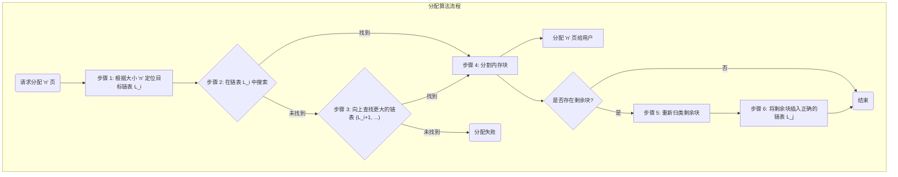
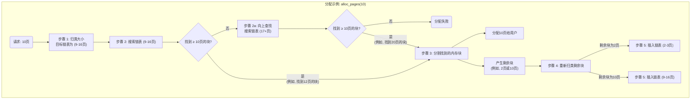

# 物理内存和页表

小组成员：
- 2310648 高景珩
- 2313892 章昊

---

## 实验目的

本实验的目的是深入理解操作系统中物理内存管理的核心概念与机制。通过分析和实现经典的连续物理内存分配算法，包括First-Fit和Best-Fit，来掌握对物理内存进行有效管理的基本方法。同时，通过可选的挑战性练习，如实现伙伴系统（Buddy System）和Slub分配算法，这将进一步探索更高级、更高效的内存管理策略，从而将操作系统原理的理论知识与ucore操作系统内核的具体实践相结合，深化对内存管理重要性和复杂性的认识。

## 实验内容

### 练习一：理解first-fit 连续物理内存分配算法（思考题）

**first-fit 连续物理内存分配算法作为物理内存分配一个很基础的方法，需要同学们理解它的实现过程。请大家仔细阅读实验手册的教程并结合kern/mm/default_pmm.c中的相关代码，认真分析default_init，default_init_memmap，default_alloc_pages， default_free_pages等相关函数，并描述程序在进行物理内存分配的过程以及各个函数的作用。 请在实验报告中简要说明你的设计实现过程。并分析你的first fit算法是否有进一步的改进空间？**

#### 已有实现的分析

在已有的设计与实现中，核心是围绕一个按物理地址升序排列的双向链表 `free_list` 来管理所有空闲内存。而整个实现最巧妙的地方，在于对 `struct Page` 结构体内 `flags` 和 `property` 这两个成员的协同使用。根据 `kern/mm/memlayout.h` 中的定义，`property` 字段用于记录一个连续内存块的总页数，但这个数值是否有效，则完全取决于 `flags` 字段中的 `PG_property` 标志位。

具体来说，一个 `Page` 结构体 `p` 被认为是**一个可供分配的空闲块的起始页**，当且仅当 `PageProperty(p)` 宏返回真（即 `p->flags` 中的 `PG_property` 位为1）。只有在这种情况下，`p->property` 中存储的块大小才是有意义的。如果 `PG_property` 位为0，那么这个页要么是已经被分配出去的块的首页，要么它根本就不是任何块的首页。这种“标志位 + 数据”的设计，清晰地区分了空闲块和非空闲块。

整个物理内存的生命周期管理正是在这个设计之上展开的。系统启动时，`default_init` 函数首先初始化一个空的 `free_list`。随后，内核调用 `default_init_memmap` 将可用的物理内存区域逐一加入管理。在这个函数中，一段连续内存的起始页会被设置正确的 `property` 值（即这块内存的总页数），并通过 `SetPageProperty()` 宏将其 `PG_property` 标志位置1，最后按地址顺序插入到 `free_list` 中，成为一个可用的空闲块。

当内核通过 `default_alloc_pages` 申请内存时，函数会从 `free_list` 头部开始遍历。它只关心那些 `PG_property` 标志位为1的页，并读取其 `property` 值来判断大小是否满足需求。这正是“首次适应”的体现——找到第一个满足条件的块。一旦找到，如果块过大，就会被分割成两部分：一部分用于分配，其起始页的 `PG_property` 标志位会被 `ClearPageProperty()` 清零，从而在 `free_list` 中“消失”；另一部分剩余的内存则会形成一个新的、较小的空闲块留在链表中。

内存的回收由 `default_free_pages` 函数负责。当一块内存被释放时，函数会重新计算其大小并存入起始页的 `property` 字段，然后调用 `SetPageProperty()` 将其“激活”为一个有效的空闲块，并插回 `free_list`。最关键的一步是紧随其后的合并操作：通过检查新块在链表中前后紧邻的邻居是否也是物理地址连续的空闲块，来实现自动合并，从而有效地对抗内存碎片化。

当然，目前实现的 First-Fit 算法也有其局限性。最主要的问题是，由于每次查找都从头开始，很容易导致在内存地址的低位部分遗留下许多难以再利用的微小碎片。长此以往，即使总的空闲内存还很多，也可能因为找不到足够大的连续空间而导致分配失败。

要改进这一点，可以考虑实现 **Next-Fit** 算法，让下一次分配的查找从上一次分配结束的位置开始，这样可以把内存的消耗更均匀地散布到整个地址空间。更进一步，可以实现 **Best-Fit** 算法，它会遍历整个链表，找出大小最接近申请需求的空闲块，这样做的好处是能最大限度地保留大块内存，但代价是每次分配都必须完整扫描一遍链表，效率会低一些。

一个更彻底的优化方案是实现**分离空闲链表 (Segregated Free Lists)**，即用多个链表来分别管理不同大小范围的内存块。当需要分配内存时，只需在对应大小范围的链表中查找即可，这可以极大地提升查找效率，也是现代操作系统中许多高级内存分配器的基本思想。

#### first-fit算法的改进————*分离空闲链表*

当前 First-Fit 算法的主要瓶颈在于其使用单一链表管理所有空闲块，导致分配时可能需要进行漫长的线性扫描，尤其是在内存碎片化之后。一个更彻底、更高效的优化方案是实现**分离空闲链表（Segregated Free Lists）**。该方案放弃单一链表的结构，转而采用多个链表，每个链表专门负责管理特定大小范围的内存块。这种按大小“分类”的策略，能够将内存分配的搜索时间从 O(N) 级别（N为总空闲块数）显著降低，接近 O(1)。

该设计的核心是建立一个**空闲链表数组**，数组中的每个元素都是一个独立的空闲链表头。我们称这些范围为“尺寸类”（Size Classes）。

1.  **数据结构**：
    我们将不再使用单个的 `free_area_t` 结构体，而是定义一个该结构体的数组，例如 `free_area_t free_areas[MAX_SIZE_CLASSES]`。数组的索引直接对应一个尺寸类。尺寸类的划分可以基于2的幂次，也可以是其他合理的数值范围。一个可行的划分方案如下：
    *   `free_areas[0]`: 管理大小为 1($[2^0-2^1)$) 页的块。
    *   `free_areas[1]`: 管理大小为 2-3($[2^1-2^2)$) 页的块。
    *   `free_areas[2]`: 管理大小为 4-7($[2^2-2^3)$) 页的块。
    *   `free_areas[3]`: 管理大小为 8-15($[2^3-2^4)$) 页的块。
    *   ...
    *   `free_areas[N]`: 管理所有大于某个阈值的超大块。

2.  **分配流程 (`alloc_pages`)**：
    *   **定位链表**：当收到一个分配 `n` 页的请求时，首先根据 `n` 的大小，通过一个简单的计算或查找，立即确定应该在哪一个尺寸类的链表（例如 `free_areas[i]`）中进行搜索。这个定位过程是 O(1) 的。
    *   **链表内搜索**：在确定的链表 `free_areas[i]` 内部，执行 First-Fit（或 Best-Fit）算法进行查找。因为这个链表中的块都是大小相近的，所以搜索范围被极大地缩小了，速度非常快。
    *   **向上查找（Fallback）**：如果在最匹配的链表 `free_areas[i]` 中没有找到合适的块（即链表为空），分配器不会立即失败，而是会自动地到**下一个更大尺寸类的链表**（`free_areas[i+1]`, `free_areas[i+2]`, ...）中去查找。
    *   **分割与归位**：当在一个更大的尺寸类中找到一个足够大的块时（例如，需要10页，但在16-31页的链表中找到了一个20页的块），分配器会将其分割。分配出10页后，剩余的10页会形成一个新的空闲块。最关键的是，这个新的10页空闲块需要被**重新定位**并插入到它自己所属的正确链表（8-15页的链表）中，而不是放回原来的大块链表。

3.  **释放流程 (`free_pages`)**：
    *   **合并（Coalescing）是关键**：在释放一个大小为 `n` 的内存块时，不能简单地将其直接插入对应尺寸的链表。必须先检查其物理地址前后的邻居是否也是空闲的，以进行合并。因为现在空闲块散布在不同的链表中，我们**不能再依赖链表的前后指针来寻找物理邻居**。取而代之的是，通过要释放块的基地址 `base`，直接计算出其前后物理页的地址 (`base-1` 和 `base+n`)，并检查这些 `Page` 结构体的 `PG_property` 标志位来判断它们是否是空闲块的头部。
    *   **跨链表合并**：如果邻居是空闲的，那么需要先将这个邻居从它**自己所在的链表**中移除，然后与当前释放的块合并成一个更大的新块。
    *   **重新归位**：合并完成后（可能与前后两个邻居都发生了合并），根据最终形成的新空闲块的总大小，计算出它所属的尺寸类，并将其插入到正确的空闲链表中。如果未发生合并，则直接将原始释放块插入其对应的链表。

#### 设计示意图

下面这张图直观地展示了分离空闲链表的工作模式：

下面是一个示例，展示了如何实现一个简单的分离空闲链表：
