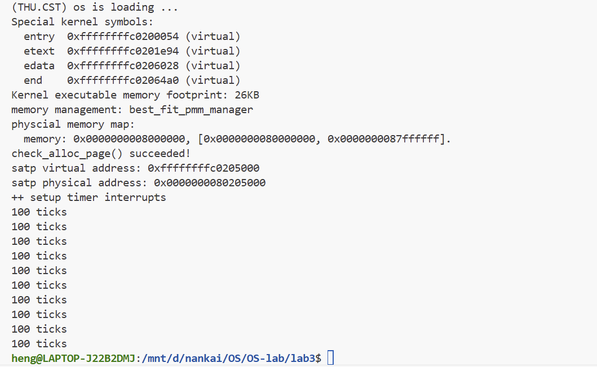

# 中断与中断处理流程

小组成员：
- 2310648 高景珩
- 2313892 章昊

---

## 实验目的

实验3围绕中断处理机制展开：操作系统作为计算机系统的“总控”，必须随时响应程序异常或外设请求等突发状况；当异常发生时，CPU立即暂停当前任务，由操作系统接管，保存现场、跳转至对应的中断服务例程，处理完毕后再恢复现场，原任务无缝继续执行。通过学习，将掌握RISC-V中断体系与相关寄存器、上下文保存与恢复的完整流程，以及断点中断和时钟中断的最简实现。

---

## 实验内容

### 练习一：完善中断处理 （需要编程）

*请编程完善trap.c中的中断处理函数trap，在对时钟中断进行处理的部分填写kern/trap/trap.c函数中处理时钟中断的部分，使操作系统每遇到100次时钟中断后，调用print_ticks子程序，向屏幕上打印一行文字”100 ticks”，在打印完10行后调用sbi.h中的shut_down()函数关机。要求完成问题1提出的相关函数实现，提交改进后的源代码包（可以编译执行），并在实验报告中简要说明实现过程和定时器中断中断处理的流程。实现要求的部分代码后，运行整个系统，大约每1秒会输出一次”100 ticks”，输出10行。*

最后实现的代码如下：
```c
case IRQ_S_TIMER:
    /*(1)设置下次时钟中断- clock_set_next_event()
     *(2)计数器（ticks）加一
     *(3)当计数器加到100的时候，我们会输出一个`100ticks`表示我们触发了100次时钟中断，同时打印次数（num）加一
     *(4)判断打印次数，当打印次数为10时，调用<sbi.h>中的关机函数关机
     */
    clock_set_next_event();
    ticks++;
    if (ticks == TICK_NUM) {
        print_ticks();
        print_num++;
        ticks = 0;
    }
    if (print_num == 10) {
        sbi_shutdown();
    }
    break;
```
执行结果如下：

在ucore操作系统中，定时器中断的实现是一个关键的功能模块，负责提供系统所需的时间基准和调度支持。整个实现过程可分为初始化、中断触发和中断处理三个主要阶段。

首先，在系统初始化阶段，通过调用clock_init()函数完成定时器的配置。该函数启用supervisor模式下的定时器中断，通过设置sie寄存器的MIP_STIP位允许定时器中断的发生。接着，调用clock_set_next_event()函数设定首次定时器中断的触发时间，该函数通过sbi_set_timer()接口向SBI固件请求设置定时器，设定的时间点为当前时间加上一个固定的时间间隔timebase（100000）。最后，初始化全局变量ticks为0，用于记录定时器中断发生的次数。

定时器中断的处理流程始于硬件层面的中断触发。当到达预设的时间点时，硬件会产生supervisor定时器中断。该中断由RISC-V架构的中断处理机制捕获，并跳转至__alltraps入口点（定义于trapentry.S中）。__alltraps负责保存处理器状态和寄存器上下文到trapframe结构体中，然后调用C语言编写的trap()函数进行进一步处理。

在trap()函数中，根据中断/异常类型将控制权分发给interrupt_handler()。interrupt_handler()通过检查trapframe中的cause字段确定中断类型为IRQ_S_TIMER（supervisor定时器中断），进而执行相应的处理逻辑。

具体的定时器中断处理逻辑实现在LAB3练习1中完成，包括四个步骤：首先调用clock_set_next_event()设置下一次定时器中断；其次将ticks计数器加一；然后判断ticks是否达到TICK_NUM（即100），如果达到则调用print_ticks()输出"100 ticks"信息并将全局变量print_num加一，同时重置ticks为0；最后检查print_num是否达到10，如果是则调用sbi_shutdown()关闭系统。

这种设计形成了一个精确可控的周期性定时器中断机制，每经过固定时间间隔就会产生中断，当累积产生1000次（100次×10轮）定时器中断后自动关闭系统，从而验证了定时器中断功能的正确性和稳定性。